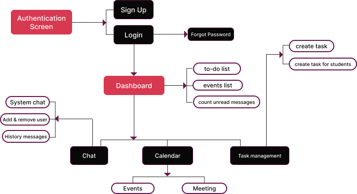

# Learn@Home
>Learn@Home est une association qui met en relation des enfants en difficulté
scolaire et des bénévoles, en ligne. Ils ont pour objectif de permettre à tout élève,
où qu’il soit, d’accéder à un soutien scolaire à distance.

## Flux d'utilisateurs
>Un schéma a été réalisé pour avoir une vue macro des fonctionnalités et des différentes pages a réaliser.

## User Stories
>Nous pouvons retrouver les premiers user-stories dans le dossier Scrum avec:

- [Inscription](./scrum/user-stories/inscription.md)
- [Connexion](./scrum/user-stories/connexion.md)
- [Navigation/Déconnexion](./scrum/user-stories/navigation-deconnexion.md)
- [Calendrier](./scrum/user-stories/calendrier.md)
- [Gestion - messagerie élève](./scrum/user-stories/gestion-messagerie-eleve.md)
- [Gestion - messagerie bénévole](./scrum/user-stories/gestion-messagerie-benevole.md)

## Cas d'usages

- [authentification](./scrum/use-cases/auth.png)
- [tableau de bord](./scrum/use-cases/dashboard.png)
- [gestion des tâches](./scrum/use-cases/tasks.png)
- [messagerie](./scrum/use-cases/messagerie.png)
- [calendrier](./scrum/use-cases/calendrier.png)

## Design

- charte graphic
	- [couleurs](./design/charte-graphic/colors.png)
	- [logo-icone](./design/charte-graphic/logo-icon.svg)
	- [logo-entier](./design/charte-graphic/logo-full.svg)
	- [typographie](./design/charte-graphic/typo.png)

- maquettes
	- [authentification](./design/maquettes/authentication)
	- [tableau de bord](./design/maquettes/dashboard)
	- [messagerie](./design/maquettes/chat)
	- [gestion des tâches](./design/maquettes/tasks)
	- [calendrier](./design/maquettes/calendar)

 Un [**prototype**](https://www.figma.com/proto/8GSsAXBP1B81KRsJqYu7Ah/learn%40Home?node-id=36%3A245&scaling=min-zoom&starting-point-node-id=36%3A245&show-proto-sidebar=1) est disponible et permet d'avoir une idée global de la navigation entre les pages.

 ## Kanban
 > Plusieurs [Millestones](https://github.com/Daphaz/DamienBonnet_10_20052022/milestones) (ici utilisés comme Titre macro des grandes fonctionnalités pour le MVP)

 La colonne ANALYZE a été complétée sur [Github](https://github.com/Daphaz/DamienBonnet_10_20052022/projects/1)